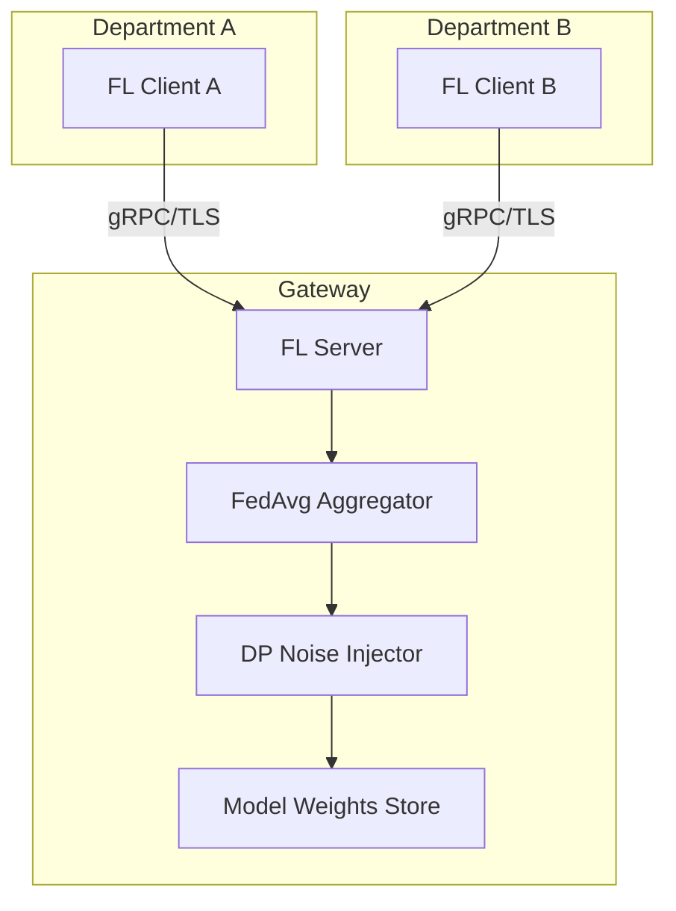

# privacy-fl-gateway


**Federated learning aggregation gateway with differential privacy for
cross-departmental model training without moving raw data.**

## Architecture



## Quick Start

```bash
pip install -e ".[dev]"
pytest -v
python -m src.server
```

## Docker

```bash
docker compose up --build
```

## Threat Model

| Threat | Mitigation |
|---|---|
| Model inversion attacks | Differential privacy noise injection (ε-bounded) |
| Gradient leakage | Secure aggregation protocol |
| Unauthorized node joining | JWT-based client authentication |
| Man-in-the-middle | Mandatory TLS for all gRPC channels |

## Project Structure

```
src/
├── server.py       # FL aggregation server
├── client.py       # FL client template
├── strategy/
│   └── dp.py       # Differential privacy strategy
└── auth/
    └── jwt.py      # JWT validation for nodes
tests/              # Unit tests
docs/adr/           # Architecture Decision Records
```

## License

MIT — see [LICENSE](LICENSE).
